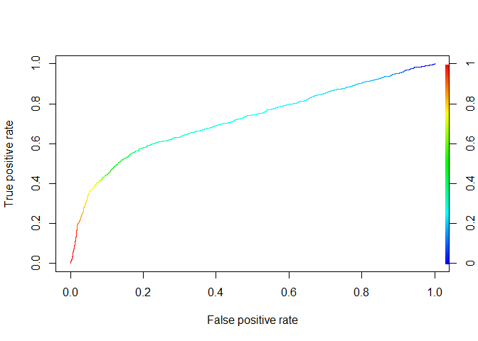

Actividad 10
================

Para esta ayudantia tendran que realizar el metodo de analisis bayesiano
para el data set de tarjetas de credito (dentro del bloc de notas podran
encontrar el link que la explicacion de las variables del data set). El
objetivo para ese data set es determinar si la persona fallara o no en
el pago de su credito a partir de las variables del dataset

``` r
library(tidyverse)
```

    ## -- Attaching packages --------------------------------------- tidyverse 1.3.1 --

    ## v ggplot2 3.3.3     v purrr   0.3.4
    ## v tibble  3.1.0     v dplyr   1.0.5
    ## v tidyr   1.1.3     v stringr 1.4.0
    ## v readr   1.4.0     v forcats 0.5.1

    ## -- Conflicts ------------------------------------------ tidyverse_conflicts() --
    ## x dplyr::filter() masks stats::filter()
    ## x dplyr::lag()    masks stats::lag()

``` r
library(e1071)
library(caret)
```

    ## Loading required package: lattice

    ## 
    ## Attaching package: 'caret'

    ## The following object is masked from 'package:purrr':
    ## 
    ##     lift

``` r
library(rstan)
```

    ## Loading required package: StanHeaders

    ## rstan (Version 2.21.2, GitRev: 2e1f913d3ca3)

    ## For execution on a local, multicore CPU with excess RAM we recommend calling
    ## options(mc.cores = parallel::detectCores()).
    ## To avoid recompilation of unchanged Stan programs, we recommend calling
    ## rstan_options(auto_write = TRUE)

    ## Do not specify '-march=native' in 'LOCAL_CPPFLAGS' or a Makevars file

    ## 
    ## Attaching package: 'rstan'

    ## The following object is masked from 'package:tidyr':
    ## 
    ##     extract

``` r
library(rstanarm)
```

    ## Loading required package: Rcpp

    ## This is rstanarm version 2.21.1

    ## - See https://mc-stan.org/rstanarm/articles/priors for changes to default priors!

    ## - Default priors may change, so it's safest to specify priors, even if equivalent to the defaults.

    ## - For execution on a local, multicore CPU with excess RAM we recommend calling

    ##   options(mc.cores = parallel::detectCores())

    ## 
    ## Attaching package: 'rstanarm'

    ## The following object is masked from 'package:rstan':
    ## 
    ##     loo

    ## The following objects are masked from 'package:caret':
    ## 
    ##     compare_models, R2

``` r
library(titanic)
library(ROCR)
```

Leemos el arcchivo y cargamos los datos

``` r
setwd("C:/Users/Dieca/OneDrive/Escritorio/actividad 10")
creditcard <- read.csv("UCI_Credit_Card.csv", sep = ",")
glimpse(creditcard)
```

    ## Rows: 30,000
    ## Columns: 25
    ## $ ID                         <int> 1, 2, 3, 4, 5, 6, 7, 8, 9, 10, 11, 12, 13, ~
    ## $ LIMIT_BAL                  <dbl> 20000, 120000, 90000, 50000, 50000, 50000, ~
    ## $ SEX                        <int> 2, 2, 2, 2, 1, 1, 1, 2, 2, 1, 2, 2, 2, 1, 1~
    ## $ EDUCATION                  <int> 2, 2, 2, 2, 2, 1, 1, 2, 3, 3, 3, 1, 2, 2, 1~
    ## $ MARRIAGE                   <int> 1, 2, 2, 1, 1, 2, 2, 2, 1, 2, 2, 2, 2, 2, 2~
    ## $ AGE                        <int> 24, 26, 34, 37, 57, 37, 29, 23, 28, 35, 34,~
    ## $ PAY_0                      <int> 2, -1, 0, 0, -1, 0, 0, 0, 0, -2, 0, -1, -1,~
    ## $ PAY_2                      <int> 2, 2, 0, 0, 0, 0, 0, -1, 0, -2, 0, -1, 0, 2~
    ## $ PAY_3                      <int> -1, 0, 0, 0, -1, 0, 0, -1, 2, -2, 2, -1, -1~
    ## $ PAY_4                      <int> -1, 0, 0, 0, 0, 0, 0, 0, 0, -2, 0, -1, -1, ~
    ## $ PAY_5                      <int> -2, 0, 0, 0, 0, 0, 0, 0, 0, -1, 0, -1, -1, ~
    ## $ PAY_6                      <int> -2, 2, 0, 0, 0, 0, 0, -1, 0, -1, -1, 2, -1,~
    ## $ BILL_AMT1                  <dbl> 3913, 2682, 29239, 46990, 8617, 64400, 3679~
    ## $ BILL_AMT2                  <dbl> 3102, 1725, 14027, 48233, 5670, 57069, 4120~
    ## $ BILL_AMT3                  <dbl> 689, 2682, 13559, 49291, 35835, 57608, 4450~
    ## $ BILL_AMT4                  <dbl> 0, 3272, 14331, 28314, 20940, 19394, 542653~
    ## $ BILL_AMT5                  <dbl> 0, 3455, 14948, 28959, 19146, 19619, 483003~
    ## $ BILL_AMT6                  <dbl> 0, 3261, 15549, 29547, 19131, 20024, 473944~
    ## $ PAY_AMT1                   <dbl> 0, 0, 1518, 2000, 2000, 2500, 55000, 380, 3~
    ## $ PAY_AMT2                   <dbl> 689, 1000, 1500, 2019, 36681, 1815, 40000, ~
    ## $ PAY_AMT3                   <dbl> 0, 1000, 1000, 1200, 10000, 657, 38000, 0, ~
    ## $ PAY_AMT4                   <dbl> 0, 1000, 1000, 1100, 9000, 1000, 20239, 581~
    ## $ PAY_AMT5                   <dbl> 0, 0, 1000, 1069, 689, 1000, 13750, 1687, 1~
    ## $ PAY_AMT6                   <dbl> 0, 2000, 5000, 1000, 679, 800, 13770, 1542,~
    ## $ default.payment.next.month <int> 1, 1, 0, 0, 0, 0, 0, 0, 0, 0, 0, 0, 0, 1, 0~

``` r
str(creditcard)
```

    ## 'data.frame':    30000 obs. of  25 variables:
    ##  $ ID                        : int  1 2 3 4 5 6 7 8 9 10 ...
    ##  $ LIMIT_BAL                 : num  20000 120000 90000 50000 50000 50000 500000 100000 140000 20000 ...
    ##  $ SEX                       : int  2 2 2 2 1 1 1 2 2 1 ...
    ##  $ EDUCATION                 : int  2 2 2 2 2 1 1 2 3 3 ...
    ##  $ MARRIAGE                  : int  1 2 2 1 1 2 2 2 1 2 ...
    ##  $ AGE                       : int  24 26 34 37 57 37 29 23 28 35 ...
    ##  $ PAY_0                     : int  2 -1 0 0 -1 0 0 0 0 -2 ...
    ##  $ PAY_2                     : int  2 2 0 0 0 0 0 -1 0 -2 ...
    ##  $ PAY_3                     : int  -1 0 0 0 -1 0 0 -1 2 -2 ...
    ##  $ PAY_4                     : int  -1 0 0 0 0 0 0 0 0 -2 ...
    ##  $ PAY_5                     : int  -2 0 0 0 0 0 0 0 0 -1 ...
    ##  $ PAY_6                     : int  -2 2 0 0 0 0 0 -1 0 -1 ...
    ##  $ BILL_AMT1                 : num  3913 2682 29239 46990 8617 ...
    ##  $ BILL_AMT2                 : num  3102 1725 14027 48233 5670 ...
    ##  $ BILL_AMT3                 : num  689 2682 13559 49291 35835 ...
    ##  $ BILL_AMT4                 : num  0 3272 14331 28314 20940 ...
    ##  $ BILL_AMT5                 : num  0 3455 14948 28959 19146 ...
    ##  $ BILL_AMT6                 : num  0 3261 15549 29547 19131 ...
    ##  $ PAY_AMT1                  : num  0 0 1518 2000 2000 ...
    ##  $ PAY_AMT2                  : num  689 1000 1500 2019 36681 ...
    ##  $ PAY_AMT3                  : num  0 1000 1000 1200 10000 657 38000 0 432 0 ...
    ##  $ PAY_AMT4                  : num  0 1000 1000 1100 9000 ...
    ##  $ PAY_AMT5                  : num  0 0 1000 1069 689 ...
    ##  $ PAY_AMT6                  : num  0 2000 5000 1000 679 ...
    ##  $ default.payment.next.month: int  1 1 0 0 0 0 0 0 0 0 ...

``` r
creditcard$ID <- NULL

creditcard$SEX <- factor(creditcard$SEX, levels=1:2, labels=c("Male", "Female"))
creditcard$EDUCATION <- as.factor(creditcard$EDUCATION)
creditcard$MARRIAGE <- as.factor(creditcard$MARRIAGE)
creditcard$default.payment.next.month <- factor(creditcard$default.payment.next.month, levels = 0:1, labels=c("No", "Yes"))
```

``` r
set.seed(42)
sample <- sample(1:nrow(creditcard), .8*30000)

trainData <- creditcard[sample,]
testData <-  creditcard[-sample,]

model_nb <- naiveBayes(default.payment.next.month~SEX+MARRIAGE+AGE+PAY_0+PAY_6+BILL_AMT1+BILL_AMT6+PAY_AMT1+PAY_AMT6, trainData, laplace=1)

pred_nb <- predict(model_nb, newdata = testData)
confusionMatrix(data=pred_nb, reference = testData$default.payment.next.month)
```

    ## Confusion Matrix and Statistics
    ## 
    ##           Reference
    ## Prediction   No  Yes
    ##        No  4104  704
    ##        Yes  548  644
    ##                                           
    ##                Accuracy : 0.7913          
    ##                  95% CI : (0.7808, 0.8016)
    ##     No Information Rate : 0.7753          
    ##     P-Value [Acc > NIR] : 0.001456        
    ##                                           
    ##                   Kappa : 0.3754          
    ##                                           
    ##  Mcnemar's Test P-Value : 1.184e-05       
    ##                                           
    ##             Sensitivity : 0.8822          
    ##             Specificity : 0.4777          
    ##          Pos Pred Value : 0.8536          
    ##          Neg Pred Value : 0.5403          
    ##              Prevalence : 0.7753          
    ##          Detection Rate : 0.6840          
    ##    Detection Prevalence : 0.8013          
    ##       Balanced Accuracy : 0.6800          
    ##                                           
    ##        'Positive' Class : No              
    ## 

``` r
pred_test_nb <- predict(model_nb, newdata = testData, type="raw")
p_test_nb <- prediction(pred_test_nb[,2], testData$default.payment.next.month)
perf_nb <- performance(p_test_nb, "tpr", "fpr")
plot(perf_nb, colorize=T)
```

<!-- -->

``` r
performance(p_test_nb, "auc")@y.values
```

    ## [[1]]
    ## [1] 0.7191649
